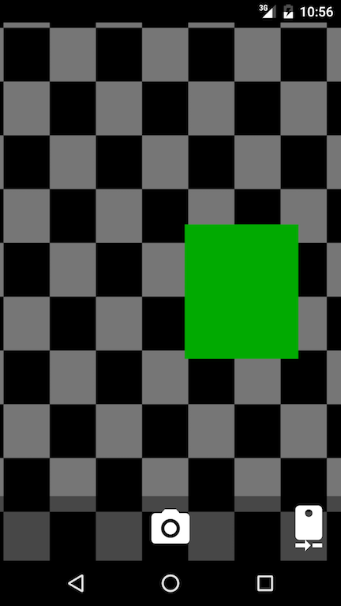

# Overview

ShowMe is an application for securing sharing non-private and private photos with trusted friends. 

Besides sending photos (with an optional text caption and optionally marked private) - you can save drafts, view the status of sent messages, and share (non-private) photos you receive to other applications.

It uses Axolotl for end-to-end encryption. Friends (and their keys/prekeys) are added via QR scanning; key verification is built-in. A built-in camera is used by default to avoid leaking taken photos to any other application/gallery. Photos are stored encrypted on disk. Tor is supported via Orbot. To prevent *casual* data leakage, private photos auto-delete after 4 hours and request not to be screenshotted.

The server is open source, and intended to be run by individuals, although a central server may be run also.

# Screenshots

## Setup

>  

## Add A Friend

>  

## Friendslist

> 

## Take a Photo, Save For Later

>    

## Friendslist w/ Drafts

>  

## Recieving a Message

>  

## Recieving a Private Message

>  

## Settings

> 

--
# FAQ

## Why not Signal?

If you have read this and don't know why you would use this instead of Signal; use Signal.

## Crypto

### End-to-End

Axolotl 1.4.3, patched to serailize things.

Axolotl (and ShowMe) leak sender/recipient metadata. Want to use [keys derived from Axolotl leafs](https://github.com/archiebell/showme/issues/10) to encrypt the axolotl ciphertext (and senderkeyid that ShowMe adds) to make sender anonymous from POV of server. Recipient uses trial decryption to find sender. Could make recipient anonymous too if users would poll and buckets generated from Axolotl leafs, but this does not allow Push notifications (also below).

### TLS

TLS with random Client Certs. Efficiency goal is Request-Response, no round trip. Security goal is attacker who breaks TLS once cannot impersonate user with replay. This requires user to sign w/ identity key, but signed request must be bound to session to prevent replay. Sign client cert w/ identity key to prevent replay of stolen request from user; server accepts and ignores client cert (except for signature check). Rotate client certs on every network change to reduce passive fingerprinting.

Would be MUCH BETTER to use TLS channel binding, but not supported in Android or Python. 

### Tor

Option, user can enable on Setup before first network use. Prompts user to install Orbot. Manually sets proxy settings. [Should examine App/ACRA for proxy leaks](https://github.com/archiebell/showme/issues/9).

## Deleting

Not secure. Assuming participants trust each other; deleting private messages is good security. Private photos delete 4 hours after first viewed. Sent private photos (if storing enabled, not default) deleted 5 days after sending, if photo has been recieved. 

## Crashes

Out of memory? Lot of items? Yes, [want to fix](https://stackoverflow.com/questions/34011680/how-can-i-tell-if-an-item-is-on-the-screen-in-android-getlocalvisiblerect-doesn). 

## Build This

### (No) Google Cloud Messaging

GCM is needed to provide efficient notification to users when a message is recieved. Alternatives are nice, provide suggestions at [issue](https://github.com/archiebell/showme/issues/13).

Likely push notifications always needed, but pure-polling solution attractive. Can eliminate all registration from server - client polls at predefined buckets (one per Axolotl leaf) to retrieve new messages. Separating those polls would completely anonymize clients; but for efficiency probably will batch. (Plus, separate polling for different buckets would need random polling times.)  

### SQLCipher / IOCipher

Want, see [issue](https://github.com/archiebell/showme/issues/12), [issue](https://github.com/archiebell/showme/issues/11)

### Password

Should be configurable in settings, ask on open, cache for 5 minutes. Would be used to unlock sqlcipher and iocipher. How to handle receiving messages with GCM push notification when app not unlocked?

### Text Replies/Chat

Want, see [issue](https://github.com/archiebell/showme/issues/18).

### Group Messages

Want, but long time from now.

--
# Setup

* git submodule init
* git submodule update

## Android

* Compile libaxolotl-java with serialization modifications (probably must disable signing in build.gradles), and place output jar in android/ShowMe/libs
* Sign up for Google Cloud Messaging
 * Get google-services.json, put it in app/google-services.json
* Edit app/src/main/java/invalid/showme/model/server/ServerConfiguration.java
* Create app/src/main/res/raw/acra_cert.pem with leaf certificate for bug endpoint

## Server

* python packages:
 * rocksdb
 * requests
 * twisted (tested with 15.2.1)
 * pyopenssl
 * https://github.com/tgalal/python-axolotl-curve25519


```
cp config.sample config
vi config
./main.py
./v1tests.py
```

## With and WithOut Bug Reporting

WithOut bug reporting (untested):

* Set constant in app/src/main/java/invalid/showme/model/server/ServerConfiguration.java to false
* Fill in enough of server config to get server running (no couchdb endpoint, username/password)
* No requests should go to endpoints, no errors should occur

With central bug reporting:

* Bug reporting can go to central bug logging server while app data can go to custom server. Lets development get crashes but no metadata!

With custom bug reporting:

* Install CouchDB
* Install [acralyzer](https://github.com/ACRA/acralyzer/wiki/setup)
* Edit server config, ServerConfiguration.java to report bugs and point at correct location
* Edit Files for testing, uncomment Debug Tools in:
 * onOptionsItemSelected in android/ShowMe/app/src/main/java/invalid/showme/activities/friendslist/FriendsListActivity.java
 * android/ShowMe/app/src/main/res/menu/menu_friends_list.xml
* File Test Bug

# License

ShowMe uses 

- libaxolotl-java GPL v3
- curve25519-java GPL v3
- ACRA Apache
- Android Priority Queue MIT
- Bouncycastle MIT
- EventBus Apache
- NetCipher Apache
- Google Play Services ??? Java Protobuf ??? AppCompat???

So ShowMe is ???? GPLv3?

